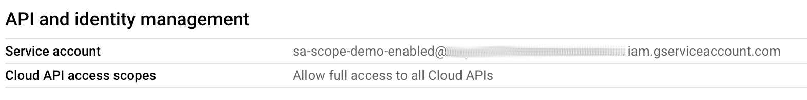
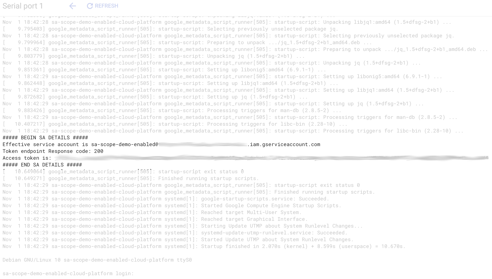

# Service Accounts and Scopes

When a VM is launched in GCP it runs with a service account identity attached that
can be used to perform authenticated API calls. If you do not specify a service
account, GCP will attempt to use the
[Default Compute Service Account](https://cloud.google.com/compute/docs/access/service-accounts#default_service_account)
for the project that is hosting the VM. An added complication is that service
accounts can be disabled which limits their ability to call APIs.

In addition, [scopes] *should* be declared in the VM configuration to limit the
API access through default authentication flow. The recommended scope is
[cloud-platform] which enables use of fine-grained IAM roles and permissions, but
there are still many legacy templates and examples published that use deprecated -
but still valid - scopes to control access to APIs. Finally, it is possible to
launch a VM without any scopes which effectively disables the builtin metadata
authentication flow.

The table below summarizes the effect of service account and scope property
combinations:

|SA is disabled|Scopes|Identity is known to VM|Auth token can be used by VM|
|-|-|-|-|
|No|Not empty|Yes|Yes|
|No|Empty|No|No|
|Yes|Not empty|Yes|No|
|Yes|Empty|No|No|

What this shows is that a VMs ability to participate in a default authentication
flow is dependent on two key items:

* The service account must be enabled; a disabled service account will not receive
  a bearer token that can be used to authenticate to APIs.
* One or more scopes must be provided; if a VM is launched with no scopes defined
  the VM is essentially cut-off from GCP's APIs.
  > NOTE: the choice of scopes is not relevant, just whether scopes are provided
  > or not.

## What is this demo

This demo contains code to spin up virtual machines under a combination of scopes
and enabled/disabled service accounts which can be used for verification or as a
starting point for investigating API behavior for VMs.

<!-- spell-checker: ignore tfvars -->
1. Copy [terraform.tfvars.example](terraform.tfvars.example) to `terraform.tfvars`
   and modify it to use your GCP project and preferred location. An optional set of
   labels can be applied too.

   ```hcl
   # The GCP project to use.
   project_id = "my-gcp-project-id"

   # The region where the VMs will be deployed and a subnet created; VMs will be in
   # zone -a.
   region = "us-west1"

   # Applied to all resources that accept labels.
   labels = {
       owner = "me_at_email_com"
       purpose = "demo"
   }
   ```

   If you want to override the set of scopes that will be used by VMs see
   [Customizing Scopes](#customizing-scopes) section.

2. Initialize Terraform

   ```shell
   terraform init
   ```

3. Create the service accounts and VMs

   Google has a quirk when creating service accounts; you cannot create a *disabled*
   service account in a single API call. Since we want to use a disabled service we
   must ensure the service account that will be disabled is created first; we do
   this by specifying a target resource for Terraform.

   ```shell
   terraform apply -auto-approve -target google_service_account_disabled
   ```

   Now that the service account that will be disabled has been created, an apply
   will ensure it is disabled while creating all the outstanding resources.

   ```shell
   terraform apply -auto-approve
   ```

### Verifying the service account and access token

Inspecting each VM in Cloud Console will verify which service accounts and scopes
have been applied to a VM (**Compute Engine** > **VM instances** > **VM name**)



The startup script will write some basic details about the service account as
observed by the VM, along with a token if it is available.

From the VM details page, click on **Serial Port 1 (console)** and scroll until
you see the script output.



<!-- spell-checker: ignore gcloud -->
### Using gcloud SDK to extract runtime info

You can also grab the relevant output from the command line using gcloud sdk
tools. The example below extracts the text between the markers for VM named
`sa-scope-demo-disabled-legacy-gdm` from GCP project `PROJECT-ID` and zone `ZONE`.

```shell
gcloud compute instances tail-serial-port-output sa-scope-demo-disabled-legacy-gdm --project PROJECT-ID --zone ZONE | awk '/##### BEGIN SA DETAILS #####/{flag=1;next}/##### END SA DETAILS #####/{flag=0}flag'
```

<!-- spell-checker: ignore gserviceaccount -->
```text
Effective service account is sa-scope-demo-disabled@PROJECT-ID.iam.gserviceaccount.com
Token endpoint Response code: 404
An access token is not available on this VM
```

> NOTE: You will need to hit Control-C to terminate when finished, as the
> `tail-serial-port-command` subcommand listens for new data.

## Teardown resources

When finished, you can clean-up all resources.

```shell
terraform destroy -auto-approve
```

## Customizing Scopes

By default, the Terraform will create virtual machines with a combination of empty
scopes, [cloud-platform] recommended scope, and some common legacy scope combinations
(taken from a couple of GDM templates). You can override and customize the set of
scopes that get applied by using the `scopes` variable.

Edit `terraform.tfvars` and add the scopes variable, which is a map of scenario
name to scope combinations.

For example, to add a new scope with read-only Compute API access, add this to
`terraform.tfvars` and execute Terraform.

```hcl
# Override scopes
scopes = {
    # I still want to test empty scopes
    no-scope = []
    # I want a pair of VMs with compute.readonly
    compute-ro = [
        "https://www.googleapis.com/auth/compute.readonly",
    ]
}
```

<!-- spell-checker: ignore markdownlint -->
<!-- markdownlint-disable no-inline-html -->
<!-- BEGINNING OF PRE-COMMIT-TERRAFORM DOCS HOOK -->
## Requirements

| Name | Version |
|------|---------|
| <a name="requirement_terraform"></a> [terraform](#requirement\_terraform) | >= 1.0 |
| <a name="requirement_google"></a> [google](#requirement\_google) | ~> 3.90 |

## Providers

| Name | Version |
|------|---------|
| <a name="provider_google"></a> [google](#provider\_google) | ~> 3.90 |

## Modules

No modules.

## Resources

| Name | Type |
|------|------|
| [google_compute_firewall.ssh](https://registry.terraform.io/providers/hashicorp/google/latest/docs/resources/compute_firewall) | resource |
| [google_compute_instance.vms](https://registry.terraform.io/providers/hashicorp/google/latest/docs/resources/compute_instance) | resource |
| [google_compute_network.network](https://registry.terraform.io/providers/hashicorp/google/latest/docs/resources/compute_network) | resource |
| [google_compute_subnetwork.subnet](https://registry.terraform.io/providers/hashicorp/google/latest/docs/resources/compute_subnetwork) | resource |
| [google_service_account.disabled](https://registry.terraform.io/providers/hashicorp/google/latest/docs/resources/service_account) | resource |
| [google_service_account.enabled](https://registry.terraform.io/providers/hashicorp/google/latest/docs/resources/service_account) | resource |

## Inputs

| Name | Description | Type | Default | Required |
|------|-------------|------|---------|:--------:|
| <a name="input_project_id"></a> [project\_id](#input\_project\_id) | The GCP project where the resources will be deployed. | `string` | n/a | yes |
| <a name="input_region"></a> [region](#input\_region) | The compute region where resources will be deployed. | `string` | n/a | yes |
| <a name="input_allowed_cidrs"></a> [allowed\_cidrs](#input\_allowed\_cidrs) | The list of source CIDRs that will be permitted to SSH to the VMs. Default is<br>['0.0.0.0/0']. | `list(string)` | <pre>[<br>  "0.0.0.0/0"<br>]</pre> | no |
| <a name="input_labels"></a> [labels](#input\_labels) | An optional set of labels to apply to generated resources. The default set is<br>empty. | `map(string)` | `{}` | no |
| <a name="input_prefix"></a> [prefix](#input\_prefix) | The prefix to apply to all generated resources; default is 'sa-scope-demo'. | `string` | `"sa-scope-demo"` | no |
| <a name="input_scopes"></a> [scopes](#input\_scopes) | A map of OAuth scope combinations, keyed by scenario name. The default values<br>will create VMs for each service account with no scopes, cloud-platform, and a<br>common legacy GDM set of scopes.<br><br>Override this to try out other combinations. | `map(list(string))` | <pre>{<br>  "cloud-platform": [<br>    "https://www.googleapis.com/auth/cloud-platform"<br>  ],<br>  "legacy-gdm": [<br>    "https://www.googleapis.com/auth/compute",<br>    "https://www.googleapis.com/auth/devstorage.read_write"<br>  ],<br>  "no-scopes": []<br>}</pre> | no |

## Outputs

No outputs.
<!-- END OF PRE-COMMIT-TERRAFORM DOCS HOOK -->
<!-- markdownlint-enable no-inline-html -->

[scopes]: https://cloud.google.com/iam/docs/best-practices-for-securing-service-accounts#access-scopes
[cloud-platform]: https://cloud.google.com/iam/docs/best-practices-for-securing-service-accounts#access-scopes
